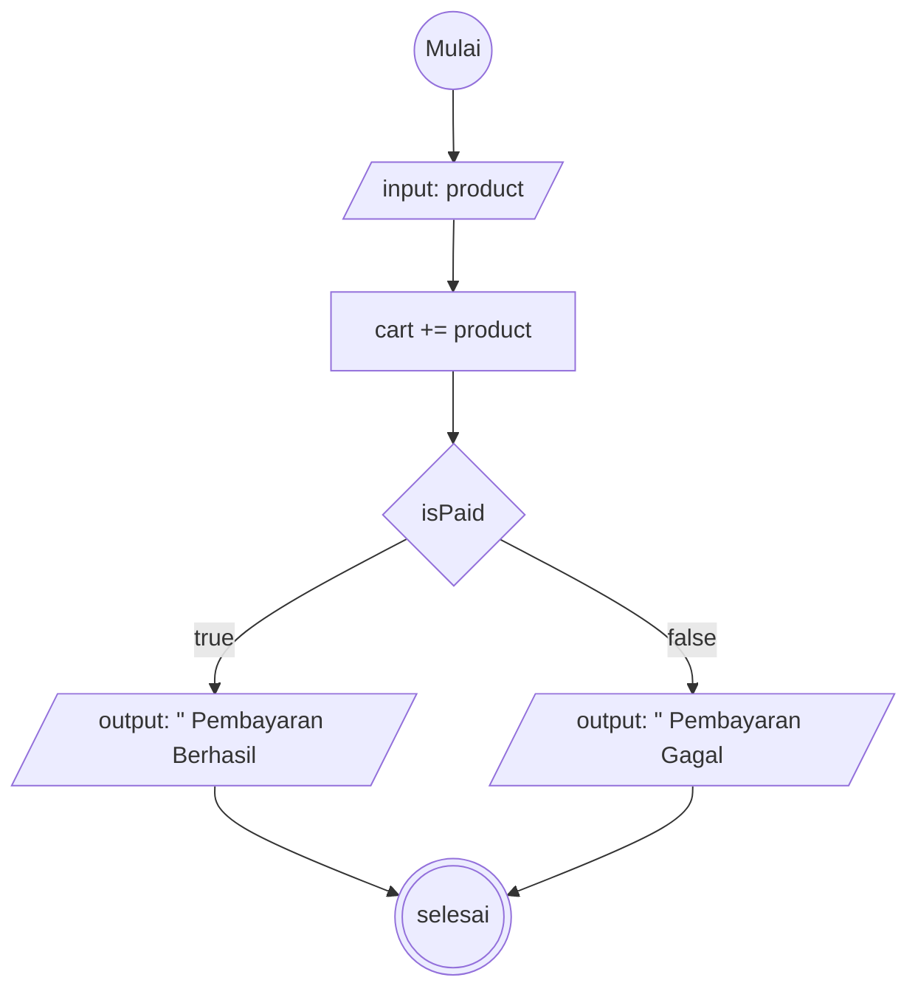

# Algoritma Proses Checkout di Tokopedia

### Algoritma
1. mulai
2. cari product yang ingin dicheckout
3. produk akan masuk ke keranjang
4. setelah menentukan barang yang ingin dicheckout, lanjut ke proses bayar
5. jika sukses akan tampil notif pembayaran berhasil
6. jika gagal, akan tampil notif pembayaran gagal

### Flowchart

    pilihMP@{shape: lean-r, label: "input: alamat, metodePembayaran"}