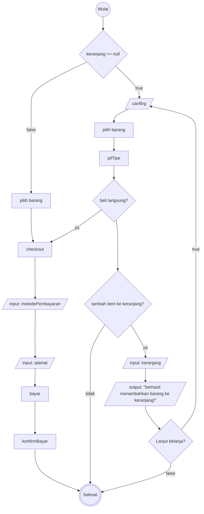
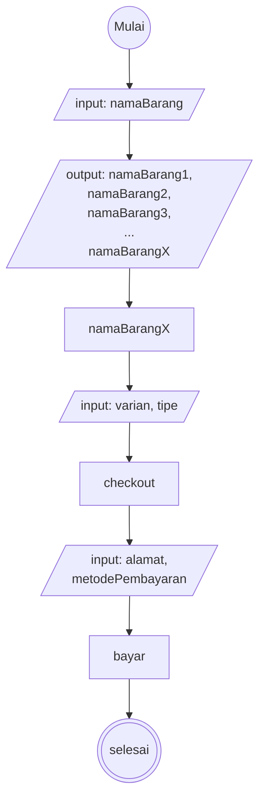

# Algoritma Proses Checkout di Tokopedia

### Algoritma
1. mulai
2. buka tokopedia
3. apakah barang yang diinginkan sudah ada di keranjang?
3. jika tidak, cari barang yang diinginkan
4. pilih barnag mana yang ingin dicheckout
5. pilih varian dan tipe yang diinginkan
6. setelah memilih tipe, bisa memilih untuk "Beli langsung" atau tambah ke keranjang
9. jika memilih "+keranjang"
10. maka akan tampil "barang berhasil ditambahkan ke keranjang" pada tampilan
11. setelah menambahkan item ke keranjang, bisa melanjutkan untuk mencari barang lain atau keluar dari tokopedia
7. jika beli langsung
8. maka lanjut untuk proses checkout
8. pilih metode pembayaran
8. sesuaikan alamat pengiriman sesuai dengan yang dikehendaki
12. lanjut ke proses pembayaran
13. konfirmasikan pembayaran
14. selesai

### Flowchart

