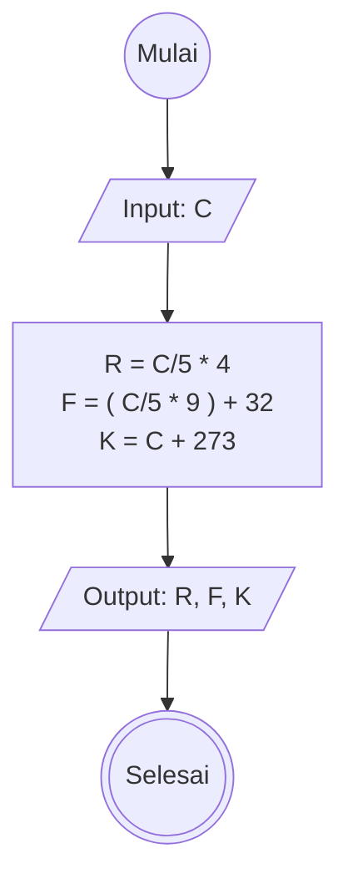

# Algoritma Program Konversi Suhu
## Deskriptif
1. Mulai
2. Input nilai suhu dalam celcius (C)
3. hitung nilai celsius (C) ke reamur (R) dengan cara mengalikan skala reamur yang bernilai 4 dengan nilai celcius (C) yang dibagi dengan skala celcius yang bernilai 5
4. hitung nilai celcius (C) ke Fahrenheit (F) dengan cara mengalikan mengalikan skala Fahrenheit yang bernilai 9 dengan nilai celcius (C) dibagi skala celcius yang bernilai 5, kemudian ditambah 32
5. hitung nilai celcius (C) ke Kelvin (K) dengan cara mengalikan mengalikan skala Kelvin yang bernilai 5 dengan nilai celcius (C) dibagi skala celcius yang bernilai 5, kemudian ditambah 273
6. tampilkan hasil konversi
7. selesai 

## Flowchart
