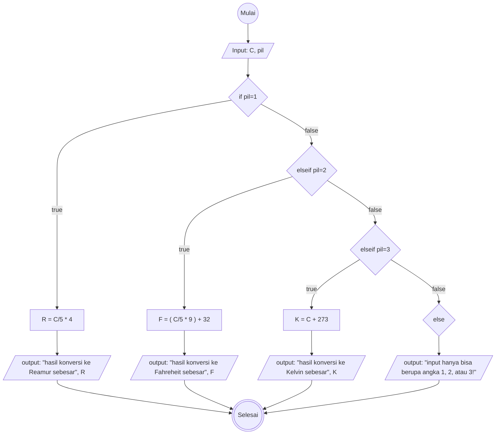
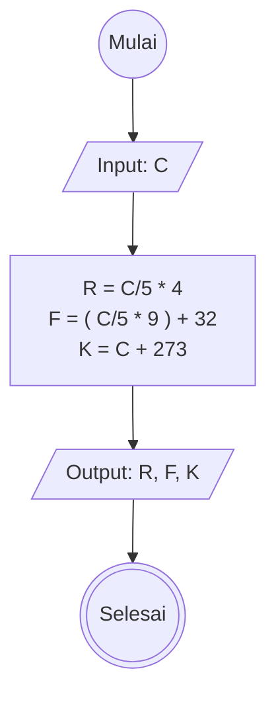

# Algoritma Program Konversi Suhu
## Deskriptif
1. Mulai
2. tentukan nilai suhu dalam celcius (C) dan angka 1,2,atau 3 untuk memilih jenis konversi. 1 untuk celcius ke reamur, 2 untuk celciuc ke fahrenheit, dan 3 untuk celcius ke kelvin, jika angka yang dipilih tidak 1,2,atau 3 maka proses konversi tidak akan berjalan
3. hitung nilai konversi celsius (C) ke reamur (R) dengan cara mengalikan skala reamur yang bernilai 4 dengan nilai celcius (C) yang dibagi dengan skala celcius yang bernilai 5
4. hitung nilai konversi celcius (C) ke Fahrenheit (F) dengan cara mengalikan skala Fahrenheit yang bernilai 9 dengan nilai celcius (C) dibagi dengan skala celcius yang bernilai 5, kemudian ditambah 32
5. hitung nilai konversi celcius (C) ke Kelvin (K) dengan cara mengalikan skala Kelvin yang bernilai 5 dengan nilai celcius (C) dibagi dengan skala celcius yang bernilai 5, kemudian ditambah 273
6. tulis hasil konversi
7. selesai 

## Flowchart

