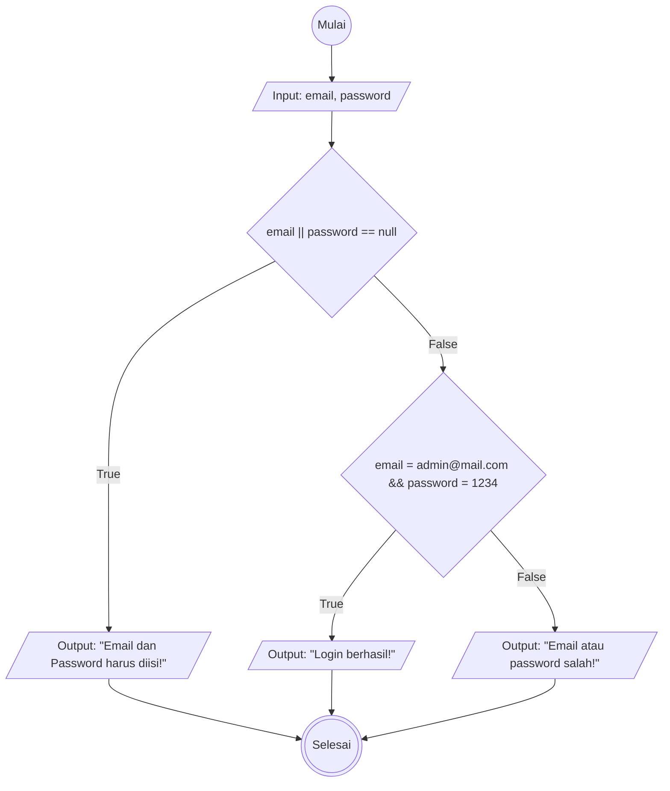

```mermaid
flowchart TD
    mulai@{ shape: circ, label: "Mulai"}
    input@{ shape: lean-r, label: "Input: email, password"}
    if@{shape: diamond, label: "email || password == null"}
    epNull@{shape: lean-r, label: "Output: #quot;Email dan Password harus diisi!#quot;"}

    ifepBenar@{ shape: diamond, label: "email = admin@mail.com && password = 1234"}
    loginBerhasil@{ shape: lean-r, label: "Output: #quot;Login berhasil!#quot;"}
    loginGagal@{ shape: lean-r, label: "Output: #quot;Email atau password salah!#quot;"}
    selesai@{ shape: dbl-circ, label: "Selesai"}
    
mulai-->input-->if
if-->|True| epNull-->selesai
if-->|False| ifepBenar
ifepBenar-->|True| loginBerhasil-->selesai
ifepBenar-->|False| loginGagal-->selesai
```