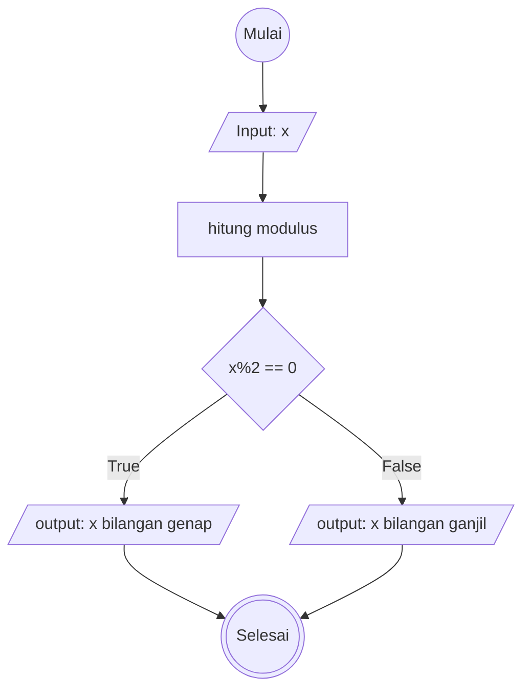

```mermaid
flowchart TD
    mulai@{ shape: circ, label: "Mulai"}
    input@{ shape: lean-r, label: "Input: x"}
    ifG@{ shape: diamond, label: "x%2 == 0"}
    ganjil@{ shape: lean-r, label: "output: x bilangan ganjil"}
    genap@{ shape: lean-r, label: "output: x bilangan genap"}
    selesai@{ shape: dbl-circ, label: "Selesai"}
    proses@{ shape: rect, label: "hitung modulus"}

mulai-->input-->proses-->ifG
ifG-->|True| genap-->selesai
ifG-->|False| ganjil-->selesai
```