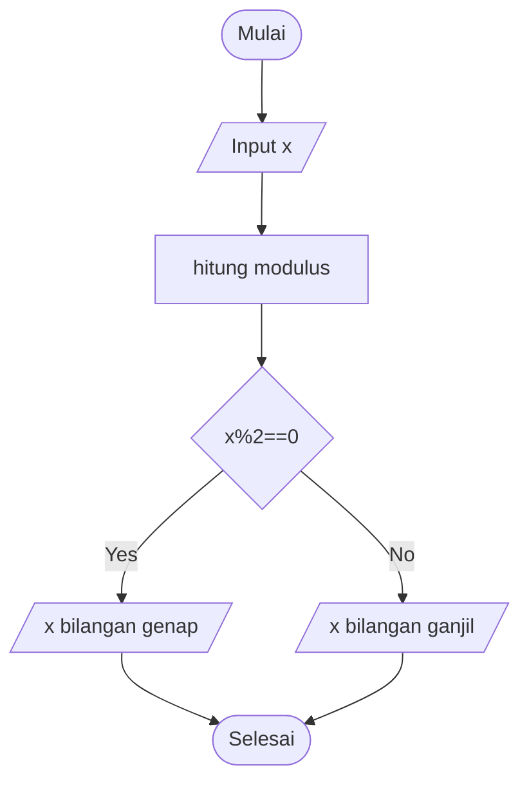

```mermaid
flowchart TD
    mulai@{ shape: stadium, label: "Mulai"}
    input@{ shape: lean-r, label: "Input x"}
    pr@{ shape: rect, label: "hitung modulus"}
    gg@{ shape: diamond, label: "x%2==0"}
    jgan@{ shape: lean-r, label: "x bilangan ganjil"}
    jgen@{ shape: lean-r, label: "x bilangan genap"}
    selesai@{ shape: stadium, label: "Selesai"}

mulai-->input-->pr-->gg
gg-->|Yes| jgen-->selesai
gg-->|No| jgan-->selesai
```