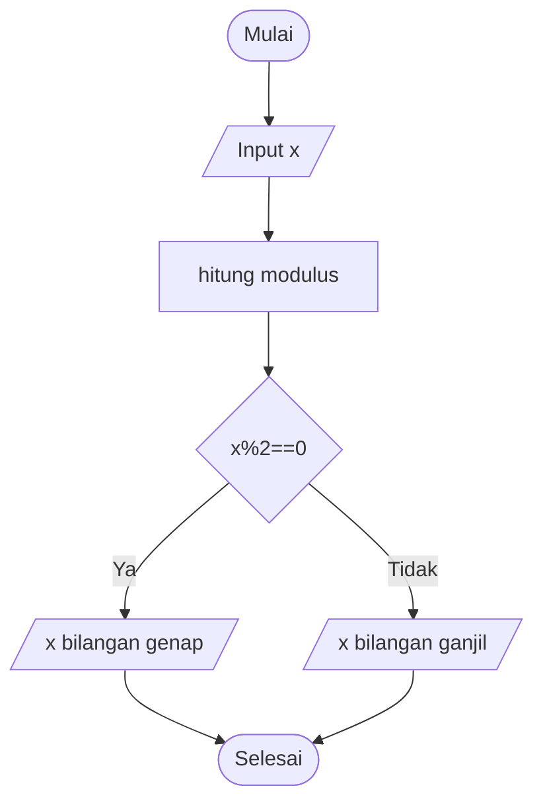

```mermaid
flowchart TD
    mulai@{ shape: stadium, label: "Mulai"}
    input@{ shape: lean-r, label: "Input x"}
    proses@{ shape: rect, label: "hitung modulus"}
    ifG@{ shape: diamond, label: "x%2==0"}
    ganjil@{ shape: lean-r, label: "x bilangan ganjil"}
    genap@{ shape: lean-r, label: "x bilangan genap"}
    selesai@{ shape: stadium, label: "Selesai"}

mulai-->input-->proses-->ifG
ifG-->|Ya| genap-->selesai
ifG-->|Tidak| ganjil-->selesai
```