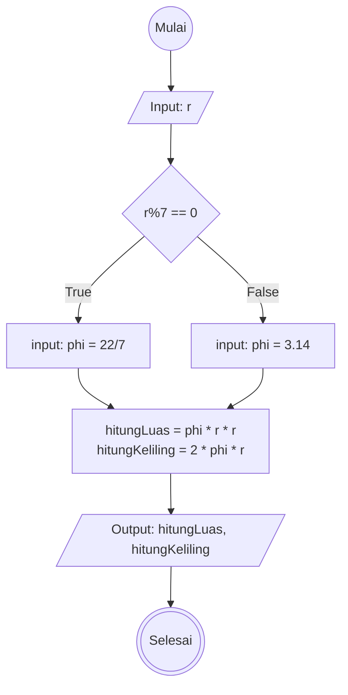

```mermaid
flowchart TD
    mulai@{ shape: circ, label: "Mulai"}
    input@{ shape: lean-r, label: "Input: r"}
    if@{shape: diamond, label: "r%7 == 0"}
    inP7@{shape: rect, label: "input: phi = 22/7"}
    inP3@{ shape: rect, label: "input: phi = 3.14"}
    hitung@{ shape: rect, label: "hitungLuas = phi * r * r
    hitungKeliling = 2 * phi * r"}
    out@{ shape: lean-r, label: "Output: hitungLuas, hitungKeliling"}
    selesai@{ shape: dbl-circ, label: "Selesai"}
    
mulai-->input-->if
if-->|True| inP7-->hitung
if-->|False| inP3-->hitung
hitung-->out-->selesai
```